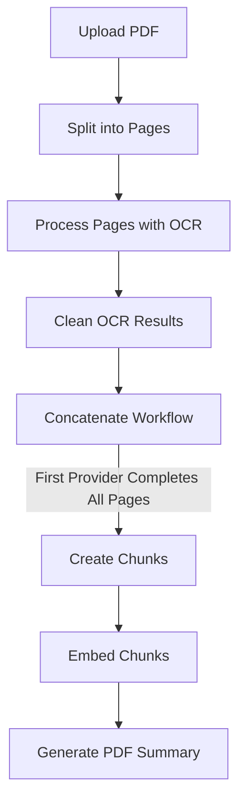

# PDF Embedding Workflow

## Overview

This document explains the PDF processing workflow, specifically focusing on how chunking and embedding are orchestrated within the system. The workflow has been optimized to ensure embedding happens exactly once per PDF, avoiding duplicate processing.

## Workflow Diagram

## Key Components

### 1. Provider Workflow (`providerWorkflow.ts`)

The provider workflow handles OCR and cleaning for each page:

1. Processes a page with OCR using either Gemini or Replicate
2. Cleans the OCR results using OpenAI
3. ~~Triggers embedding if all pages are ready~~ (Removed to avoid duplicate triggers)

### 2. Concatenate Workflow (`concatenateWorkflow.ts`)

The concatenate workflow now exclusively handles embedding:

1. Waits until all pages for a PDF are cleaned by at least one provider
2. Concatenates the text for all pages in sequence
3. Checks if chunks already exist (for idempotency)
4. Starts embedding process only if needed
5. Generates a PDF summary in parallel

### 3. Chunk and Embed Action (`ingest.ts`)

The `chunkAndEmbed` action includes multiple idempotency checks:

1. Checks if embedding is already complete
2. Creates chunks only if needed
3. Schedules embedding only if chunks don't have embeddings

## Important Changes

1. Removed the embedding trigger from `providerWorkflow.ts` to avoid duplicate work
2. Enhanced idempotency checks in `concatenateWorkflow.ts` and `chunkAndEmbed`
3. Made `triggerChunkAndEmbedFromPageCleaning` a no-op for backward compatibility
4. Added more robust logging to track the workflow

## Testing

To test this workflow:

1. Upload a PDF
2. Monitor the logs for the message: "All pages complete for PDF ... - concatenateWorkflow will handle embedding (exclusively)"
3. Verify that chunking and embedding happens exactly once
4. Confirm that the embeddings are identical to baseline through the search functionality

## Troubleshooting

If embedding isn't occurring:

1. Check if all pages have been processed by at least one provider
2. Verify that the concatenate workflow is being triggered
3. Look for console logs indicating skipped embedding due to idempotency checks